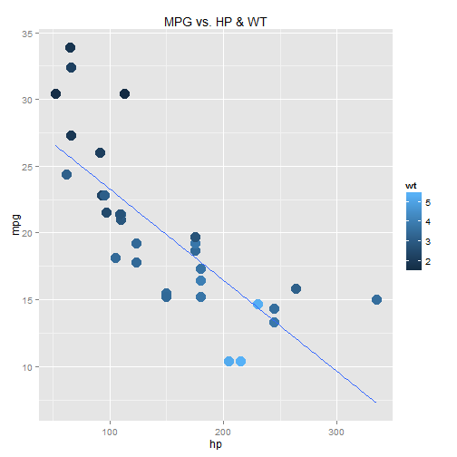

##  Presentation

This is part of the Course Project for the Coursera Developing Data Products class. The peer assessed assignment has two parts. First, create a Shiny application and deploy it on Rstudio's servers. Second, use Slidify or Rstudio Presenter to prepare a reproducible pitch presentation about the application. This presentation is the second part of the course project.

The app developed for the first part of the assignment is avalilable at:

[Shinyapps](https://billn.shinyapps.io/commute)

Source code for ui.R and server.R files are available on the GitHub:

[GitHub](https://github.com/billnic/DP_proj)

--- .class #id 

## Motor Trend Car Road Tests

The data was extracted from the 1974 Motor Trend US magazine, and comprises fuel consumption and 10 aspects of automobile design and performance for 32 automobiles (1973-74 models).


```r
library(datasets)
head(mtcars, 5)
```

```
##                    mpg cyl disp  hp drat    wt  qsec vs am gear carb
## Mazda RX4         21.0   6  160 110 3.90 2.620 16.46  0  1    4    4
## Mazda RX4 Wag     21.0   6  160 110 3.90 2.875 17.02  0  1    4    4
## Datsun 710        22.8   4  108  93 3.85 2.320 18.61  1  1    4    1
## Hornet 4 Drive    21.4   6  258 110 3.08 3.215 19.44  1  0    3    1
## Hornet Sportabout 18.7   8  360 175 3.15 3.440 17.02  0  0    3    2
```

---
## Excerpt from blueskymodel.org/gallon-gas

(http://blueskymodel.org/gallon-gas)

On average, one gallon of gasoline produces 18.07 pounds of carbon dioxide. If your car gets 20 miles-per-gallon and you drive 10,000 miles in a year, you'll produce 4.5 short tons of carbon dioxide.

In 2012, the US Energy Information Administration estimated one gallon of gas produces 19.6 pounds of carbon dioxide. The discrepancy probably stems from the fact that they tested actual gasoline with all its additives and other compounds, not just octane. In additition, they probably considered the effect of other gases in the air like nitrogen, carbon dioxide, etc.

There are other molecules in the reaction. We aren't saying that you get 18.1 pounds of carbon from 5.7 pounds of carbon (about the weight of a gallon of gas). That would defy physics! We're saying you get 18.1 pounds of carbon dioxide and 8.3 pounds of water from 5.7 pounds of gasoline (1 gallon) and 20.5 pounds of oxygen.

--- plot2

## How Horsepower and Weight decrease your MPG ##

```r
require(ggplot2)
data(mtcars)
ggplot(mtcars,aes(hp,mpg)) + geom_point(aes(color=wt),size=5) + 
        geom_smooth(aes(color=am),se=F,method="lm") + theme(legend.position = "right")+
        labs(title="MPG vs. HP & WT")
```

 

